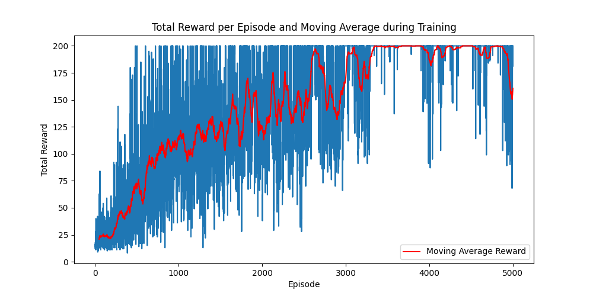

# Implementation of Q-learning to a cartpole environment
## Basics
The cartpole environment is procured using the CartPole enviroment provided by OpenAI Gym

### Objective
Balance a pole on a moving cart as long as possible by applying forces to the cart

### State space
The state space is continuous and represented by four variables.  
- cart position ($x$)
- cart velocity ($\dot{x}$)
- pole angle ($\theta$)
- pole angular velocity ($\dot{\theta}$)

### Action space
There are two discrete actions.  
- '0': Push cart to the left
- '1': Push cart to the right

### Reward
The agent receives a reward of '+1' for every time steo the pole remains upright

## Algorithm
Q-learning is a model free RL algorithm. The agent learns a value function $Q(s, a)$ that tells it the maximum expected future reward achievable from any given state $s$ by taking action $a$

### Q-Value update rule
$Q(s,a) \leftarrow Q(s,a) + \alpha \cdot (r + \gamma \cdot \max_{a'} Q(s',a') - Q(s,a))$

where
- s is the current state
- a is the current action
- s' is the resultant state after taking action a
- $\alpha$ is the learning rate
- $\gamma$ is the discount factor

## Discretizing the state space
Q-Learning is traditionally used with discrete spaces, which means that the continuous state space described above should be discretized. 
The discretization can be done by dividing each continuous variable into "bins". This way each combination of bin values represents a unique discrete state.

## Results and Observations

- The agent was trained for 5,000 episodes with a maximum of 200 steps per episode.
- The training process showed improvement in performance, with the average episode reward increasing over time.

### Performance Graph
You can add a plot showing the rewards per episode to visualize the agent's learning progress. For example:

- The agent successfully learns to balance the pole for longer durations as training progresses.

## Limitations and Future Improvements

### Limitations
- **Discretization of State Space**: The current approach uses discretization of continuous state variables, which can limit the precision and performance of the Q-learning algorithm.
- **Fixed Learning Rate**: A static learning rate is used, which may not be optimal throughout the entire training process.

### Future Improvements
- **Continuous State Space Handling**: Implementing a deep Q-network (DQN) can better handle the continuous state space without discretization.
- **Dynamic Learning Rate**: Introducing a dynamic learning rate that decreases as the agent learns more can improve convergence.
- **Reward Shaping**: Enhancing the reward structure to encourage the agent to balance the pole more effectively could lead to faster learning.

## References

- [OpenAI Gym Documentation](https://www.gymlibrary.dev/)
- [Sutton, R. S., & Barto, A. G. (2018). "Reinforcement Learning: An Introduction". MIT Press.](http://incompleteideas.net/book/the-book-2nd.html)
- [Q-learning Wikipedia](https://en.wikipedia.org/wiki/Q-learning)
